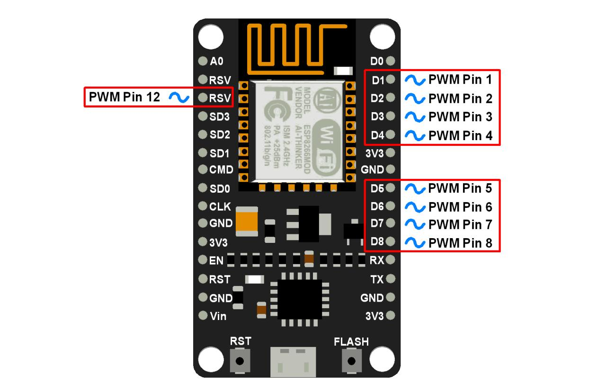
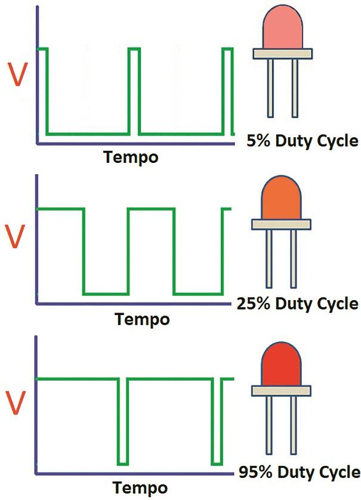

# 3. Mudar o brilho de uma lâmpada ao decorrer do tempo

Esse projeto consiste na mudança do brilho de um LED utilizando a função ```analogWrite```.

O circuito também conhecido como "fading in and fading out" permite alterar o brilho do LED. Apesar de parecer uma aplicação simples, normalmente, em projetos utilizando microcontroladores não temos como definir uma saída diferente de ligado ou desligado, afinal essa informação é digital. No entanto, se quisermos que um LED apresente um brilho intermediário, o que devemos fazer? Além do mais, em aplicações reais existem níveis intermediários entre o mínimo ou desligado e o máximo, como em um ventilador ou volume em uma caixa de som, por exemplo.

> Nesse projeto você irá aprender como relizar uma escrita analógica, utilizando a função ```analogWrite``` através do controle de um brilho de uma lâmpada.

## Conteúdo
- [Materiais Necessários](#materiais-necessários)
- [Montagem do Circuito](#montagem-do-circuito)
- [Código do Circuito](#o-c&oacute;digo-do-circuito)

## Materiais Necessários
1. NodeMCU
2. 1 LED
3. 1 Resistor de 220Ω
4. Protoboard
5. Jumpers

## Montagem do Circuito
O circuito deve ser montado como mostra a figura abaixo, representado na protoboard.


É necessário conectar um terminal do LED em um pino digital do NODEMCU com capacidade para gerar PWM, pois através dessa conexão, é possível, por conta do pino ser digital, controlar o envio de 5V ou 0V para o LED (ligando/desligando) e além disso, pela capacidade de gerar PWM, controla-se o valor intermediário de tensão enviado para a saída. 

Essas são os pinos dísponúveis para o uso do PWM:


Nesse sentido, faz-se necessário entender um tópico novo na síntese de circuitos. O que significa PWM? Os microcontroladores são digitais e portanto, a representação, bem como o processamento de informações analógicas são feitas através de um sinal digital que oscila entre 0v e 5v. Para representar um sinal com 2.5V poderiamos realizar uma escrita digital em 5V, outra em 0V, uma em 5V, outra em 0V, alternando isso rapidamente, assim, o _efeito_ resultante, será um de 2.5V.




O outro terminal, deve ser conectado a um resistor de 220Ω limitador de corrente e, em seguida, ir direto para o GND.

## O código do Circuito

Use o código que está em [code](code/code.ino) ou copie o código abaixo:
 
```C++
const int led = 14;

void setup() {
  Serial.begin(115200);
  pinMode(led, OUTPUT);
}

void loop() {
  for(int i=0; i<300; i++) {
    analogWrite(led,i);
    Serial.println(i);
    delay(10);
  }
}
```
O código acima começa com a declaração e associação da saída utilizada. O LED foi associado à constante 14. Feito isso, partimos para o ```void setup``` onde é necessário iniciar a comunicação serial através do comando "Serial.begin" e declarar as entradas e saídas por meio do pinMode.

Posteriormente, no ```void loop``` iniciamos a estrutura de repetição ```for```  que vai incrementar uma variável ```i``` até 300. 

Você deve estar se perguntando por quê 300? A escolha desse valor está relacionada com a saturação do brilho do LED. Chega um momento em que o incremento não causa um aumento de brilho, nesse caso atinge-se a saturação. É imperioso saber também que esse incremento poderia chegar até 1023 e esse valor limite igual a 1023 está relacionado com a construção interna do microcrontrolador, isto é, o microcontrolador ESP utiliza 10 bits (1024 estados diferentes) para gerar o PWM.

Além disso, utiliza-se a função ```analogWrite``` que tem a seguinte sintaxe: ```analogWrite(pin,value)```. O ```pin``` é justamente a entrada ou saída declarada no ```void setup```, enquanto que ```value``` é um parâmetro que varia entre um valor entre 0 (sempre desligado) e 300 (sempre ligado).


Caso tenha tido algum problema abra uma _issue_ clicando [aqui](https://github.com/PETEletricaUFBA/IoT/issues/new)


> Pense na utilização da função ```analogWrite``` em outras aplicações e com outras saídas. 
