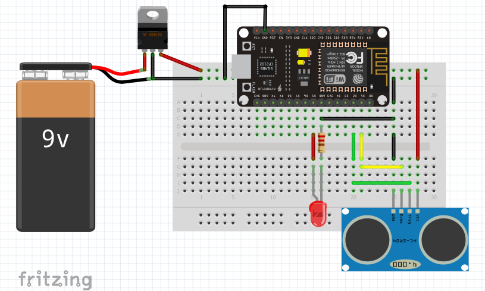
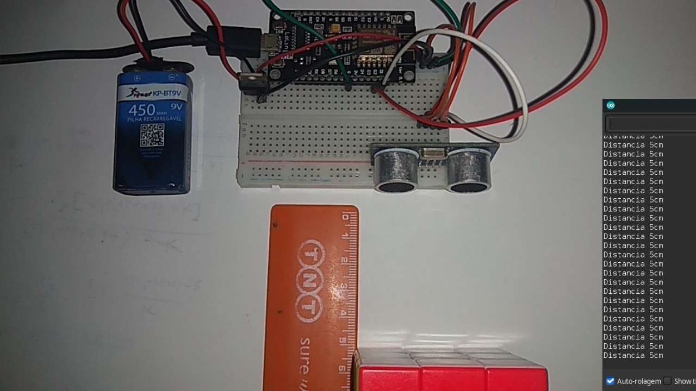

# 06. Circuito e programa com sensor de distância

Esse projeto consiste na utilização da função ```digitalRead```  juntamente com o sensor ultrassônico visando aplicações do mundo real.

O sensor ultrassônico  é um componente eletrônico capaz de emitir e receber ondas mecânicas. Este dispositivo é composto por um emissor e um receptor e é responsável por emitir um pulsor de onda ultrassônica que será refletido no objeto. Após desviar no objeto, a onda ultrassônica volta para o receptor do ultrassônico. Como se sabe a velocidade de transmissão e recepção da onda ultrassônica (velocidade do som), bem como o tempo que levou para ir do emissor-objeto-receptor, então temos conhecimento da distância entre o objeto medido e o sensor. O sensor HC-SR04, por exemplo, apresenta um range de 2 cm a 4m.

Portanto, esses sensores podem medir variáveis como enchimento e altura sem ter que entrar em contato com os elementos do meio, o que é uma grande vantagem quando comparado com outros tipos de sensores. Uma outra vantagem é que o sensor ultrassônico não possui sua operação prejudicada pela transparência, poeira, sujeira ou vapores/gases presentes no ambiente.  Desde que o objeto reflita as ondas sonoras, é possível usar um sensor ultrassônico independentemente de seu acabamento superficial ou cor. Existem sensores que podem medir distâncias de dezenas de metros com ótima precisão. Devido a todas essas características, os sensores ultrassônicos são amplamente utilizados na indústria e em várias aplicações de robótica e automação.

A seguir, algumas das principais aplicações do sensor:
* Detecção de objetos e verificação de presença;
* Medição de altura e largura;
* Medição de níveis de enchimento;
* Posicionamento de sistemas robóticos;
* Correção de rota de robôs e outros mecanismos móveis como carros de controle remoto.

O circuito envolvendo o sensor ultrassônico envolve as seguintes competências trabalhadas no módulo 1:

- [x] Leitura Digital
- [x] Escrita Digital

> Nesse projeto você irá aprender a utilizar o ultrassônico, juntamente com o processo de escrita digital com a função  ```digitalWrite```.

## Conteúdo
- [Materiais Necessários](#materiais-necessários)
- [Montagem do Circuito](#montagem-do-circuito)
- [O Código do Circuito](#código-do-circuito)

## Materiais Necessários
1. NodeMCU
2. 1 Sensor ultrassônico HC-SR04
3. 1 LED
4. 1 Resistor de 220Ω
5. Protoboard
6. Jumpers
7. Regulador de tensão 7803

## Montagem do Circuito
O circuito deve ser montado como mostra a figura abaixo, representado na protoboard.



É necessário conectar um terminal do LED em um pino digital do NODEMCU, pois através dessa conexão, é possível, por conta do pino ser digital, controlar o envio de 5V ou 0V para o LED (ligando/desligando).

O outro terminal, deve ser conectado a um resistor de 220Ω limitador de corrente e, em seguida, ir direto para o GND.

O sensor de presença é uma entrada que gera um sinal digital e por esse mesmo motivo o terminal XXX do sensor deve ser conectado a um pino digital do ESP. Os outros terminais devem ser conectados no VCC e no GND.

## O código do Circuito

Use o código que está em [code](code/code.ino) ou copie o código abaixo:
 
```C++
#include "Ultrasonic.h" 
const int echoPin = 4; 
const int trigPin = 5;

Ultrasonic ultrasonic(trigPin,echoPin); 

int distancia; 
String result;

void setup(){
  pinMode(echoPin, INPUT); 
  pinMode(trigPin, OUTPUT); 
  Serial.begin(115200);
  }
void loop(){
  
  hcsr04(); 
  Serial.print("Distancia "); 
  Serial.print(result); /
  Serial.println("cm"); 
  
}
void hcsr04(){
    digitalWrite(trigPin, LOW); 
    delayMicroseconds(2); 
    digitalWrite(trigPin, HIGH); 
    delayMicroseconds(10); 
    digitalWrite(trigPin, LOW); 
    
    distancia = (ultrasonic.Ranging(CM)); 
    result = String(distancia); 
    delay(500);
 }
  
```
Diferentemente dos outros circuitos que foram mostrados nesse módulo, esse circuito precisa de uma biblioteca em específico: ``ultrasonic.h``

A partir dessa biblioteca podemos fazer uso do sensor HCSR-04.

O código acima começa com a declaração e associação das saídas e entradas utilizadas. O pino "echo" foi associado à constante 4 (D2) e o pino "trigger" à constante 5 (D1). Feito isso, partimos para o ```void setup``` onde é necessário iniciar a comunicação serial através do comando ``Serial.begin`` e declarar as entradas e saídas por meio do ``pinMode``.

**Nota:** O pino trigger do sensor é uma saída, uma vez que emite o sinal de onda mecânica, enquanto que o echo recebe esse pulso após refletir no objeto e por esse mesmo motivo é uma entrada.

Posteriormente no ```void loop``` declaramos uma outra função ```hcsr04()``` que vai ser responsável pela ativação do funcionamento do sensor. Além disso, configuramos o monitor serial para mostrar um texto(Distância) seguido do resultado e um outro texto (cm)

Por fim e não menos importante, temos a função ```hcsr04``` que é chamada dentro da ```void loop```. Essa função começa enviando um pulso de onda mecânica pelo trigger:

```
    digitalWrite(trigPin, LOW); 
    delayMicroseconds(2); 
    digitalWrite(trigPin, HIGH); 
    delayMicroseconds(10); 
    digitalWrite(trigPin, LOW);
```
Em seguida utiliza-se a função ``Ranging`` responsável por converter uma medida de tempo (tempo que levou desde o envio do pulso até o recebimento no echo) em uma medida de distância em cm. Depois, armazena-se essa distância em cm, na variável distância.
Por fim, declara-se a variável result que como podemos visualizar abaixo, nada mais é que a conversão da variável distância em uma string.
```result = String(distancia); ```

Caso tenha tido algum problema abra uma _issue_ clicando [aqui](https://github.com/PETEletricaUFBA/IoT/issues/new)



> Pense na utilização do sensro ultrassônico na sua casa ou em outras aplicações do seu cotidiano. 
