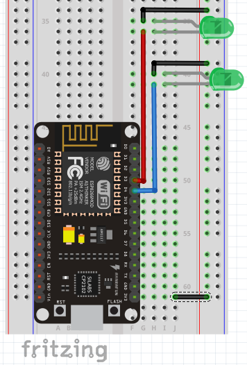

# 4.1 Integração do BOT em um projeto físico:

No tópico [Criação de um BOT no Telegram](https://github.com/PETEletricaUFBA/automacao-iot-nodemcu/tree/master/M%C3%B3dulo%203/Telegram/1.%20Cria%C3%A7%C3%A3o%20de%20um%20BOT%20pelo%20Telegram) ensinamos como criar um BOT (robô virtual) utilizando o Telegram. Esse robô, quando programado, pode realizar infinitas ações nos mais diversos contextos. Para o contexto abordado nesse presente repositório, buscamos fazer com que esse robô virtual possa monitorar e informar sobre estados de variáveis ou atuar sobre as saídas dos projetos físicos. O robô é capaz de, por exemplo, desligar ou ligar uma luz, aumentar/diminuir a temperatura de um ar condicionado, abrir a trava eletrônica de uma porta, emitir um alerta no seu celular quando alguém passar por um determinado perímetro da casa, controlar um robô, etc.

Você nesse momento pode estar se perguntando, por que eu quero integrar um robô do Telegram com um projeto físico que eu tenho na minha casa ou na minha empresa, por exemplo? A resposta é simples, quando conecta-se um BOT com um projeto físico, é possível controlar aquela aplicação em qualquer lugar do ambiente (é necessário estar conectado a uma rede local que vai ser a mesma do seu ESP 8266), desde que você tenha acesso a internet. Em um tópico futuro ensinaremos como controlar um projeto físico de qualquer lugar do planeta a partir de QUALQUER rede de internet.

Dessa forma, nesse tópico aprenderemos a integrar o BOT criado no tópico anterior a um projeto físico qualquer. Para fins de simplificação e foco no objetivo principal do módulo, escolhemos um projeto em que a função do BOT vai ser desligar e ligar dois LEDs diferentes, bem como informar o estado atual do BOT.

Antes de começarmos a falar propriamente dessa aplicação, lembre-se de ter guardado o Token do BOT criado no tópico anterior. Através dele será possível controlar o seu BOT e permitir que a ação pretendida seja realizada por ele.

## Conteúdo
- [Materiais Necessários](#materiais-necessários)
- [Montagem do Circuito](#montagem-do-circuito)
- [O Código do Circuito](#o-c&oacute;digo-do-circuito)

## Materiais Necessários
1. NodeMCU
3. 2 LEDs
4. Protoboard
5. Jumpers

## Montagem do Circuito
O circuito deve ser montado como mostra a figura abaixo, representado na protoboard.



É necessário conectar um terminal do LED em um pino digital do NODEMCU, pois através dessa conexão, é possível, por conta do pino ser digital, controlar o envio de 5V ou 0V para o LED (ligando/desligando).

O outro terminal de cada um dos LEDs devem ser conectados ao GND.


## O código do Circuito

Use o código que está em [code](code/code.ino) ou copie o código abaixo:
 
```C++
//Autor: Arduino e Cia//Modificado pelo PET Elétrica
#include "CTBot.h"
CTBot myBot;
//Definicoes da rede wifi e conexao
String ssid  = "COLOQUE O NOME DA SUA REDE WI-FI"; //Nome da sua rede wifi
String pass  = "COLOQUEAQUI A SENHA DO WI-FI"; //Senha da sua rede wifi
String token = "1678005731:AAHBn2rS173oS4Elnnp8YmQEQNwMaJx-fOw"; //Token bot Telegram
//Pinos dos leds
uint8_t led1 = D4;
uint8_t led2 = D3;
void setup()
{
  Serial.begin(115200);
  Serial.println("Inicializando bot Telegram...");
  //Conexao na rede wifi
  myBot.wifiConnect(ssid, pass);
  //Define o token
  myBot.setTelegramToken(token);
  //Verifica a conexao
  if (myBot.testConnection())
    Serial.println("nConexao Ok!");
  else
    Serial.println("nFalha na conexao!");
  //Define os pinos dos leds como saida e apaga os leds
  pinMode(led1, OUTPUT);
  pinMode(led2, OUTPUT);
  digitalWrite(led1, HIGH);
  digitalWrite(led2, HIGH);
}
void loop()
{
  //Variavel que armazena a mensagem recebida
  TBMessage msg;
  //Verifica se chegou alguma mensagem
  if (myBot.getNewMessage(msg))
  {
    //Verifica se foi recebia a mensagem "Liga 1"
    if (msg.text.equalsIgnoreCase("LIGA 1"))
    {
      //Liga o led 1 (vermelho)
      digitalWrite(led1, LOW);
      //Retorna uma pensagem informando que o led foi aceso
      myBot.sendMessage(msg.sender.id, "LED 1 Aceso!");
    }
    else if (msg.text.equalsIgnoreCase("DESLIGA 1"))
    {
      digitalWrite(led1, HIGH);
      myBot.sendMessage(msg.sender.id, "Como o(a) senhor(a) solicitou, o LED 1 foi Apagado!");
    }
    else if (msg.text.equalsIgnoreCase("LIGA 2"))
    {
      digitalWrite(led2, LOW);
      myBot.sendMessage(msg.sender.id, "LED 2 Aceso!");
    }
    else if (msg.text.equalsIgnoreCase("DESLIGA 2"))
    {
      digitalWrite(led2, HIGH);
      myBot.sendMessage(msg.sender.id, "Como o(a) senhor(a) solicitou, o LED 2 foi Apagado!");
    }
    else
    {
      //Caso receba qualquer outro comando, envia uma
      //mensagem generica/informativa
      String reply;
      reply = (String)"Ola " + msg.sender.username + (String)"! Como está você? Provavelmente você enviou uma mensagem inválida. Envie uma mensagem aceita!";
      myBot.sendMessage(msg.sender.id, reply);
    }
  }
  delay(500);
}
  
```
Assim como algumas outras aplicações que foram mostradas em módulos anteriores, precisa-se utilizar duas bibliotecas específicas ArduinoJson e a CTBot. : [``ArduinoJson``](library/ArduinoJson.zip) e [``CTBot``](library/CTBot.zip)**Clique nos links ao lado, realize o download da biblioteca, instale na sua IDE, como já o fizemos outras vezes antes de prosseguir para os próximos passos.**


O código acima é responsável por realizar as seguintes ações:

1. Conecta na WiFi configurada 
2. Configura os sensores e atuadores 
3. Fica em loop consultando por novas mensagens no Telegram.
4. Ao receber novas mensagens, começa o tratamento de cada comando.

> Observa-se que o único comando programado via código é o de ligar e desligar o LED. Pense na possibilidade de conectar outros atuadores/sensores e adicionar novos comandos.

O resultado obtido através da integração do BOT pode ser visto na imagem e GIF a seguir através das telas do Telegram e o projeto físico:

COLOCAR FOTOS AQUI
GIFS TAMBÉM


Caso tenha tido algum problema abra uma _issue_ clicando [aqui](https://github.com/PETEletricaUFBA/IoT/issues/new)
